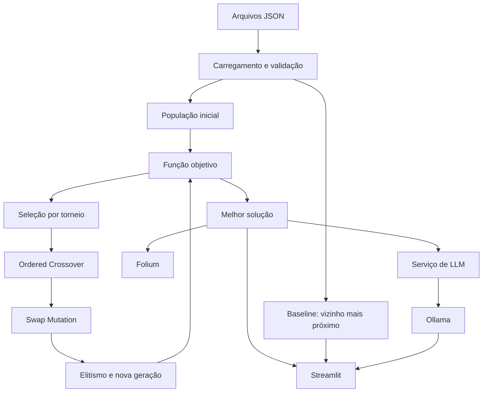

# Medical Route Optimizer

Sistema de otimização de rotas para distribuição de medicamentos e insumos hospitalares utilizando **algoritmo genético**, comparação com um **baseline guloso**, visualização em mapa e integração com uma **LLM local via Ollama**.

O projeto foi desenvolvido como parte do Tech Challenge da Fase 2 da FIAP.

---

## Visão geral

O sistema resolve uma variação do **Vehicle Routing Problem (VRP)**.

O cenário possui:

- um centro de distribuição;
- múltiplas entregas médicas;
- prioridades diferentes;
- demanda de carga por entrega;
- múltiplos veículos;
- capacidade máxima por veículo;
- autonomia máxima por veículo.

O algoritmo busca uma boa ordem de atendimento e distribui as entregas entre os veículos, considerando:

- distância total estimada;
- prioridade das entregas;
- excesso de carga;
- excesso de autonomia.

A solução também compara o algoritmo genético com o método do **vizinho mais próximo** e utiliza uma LLM para gerar relatórios operacionais e responder perguntas sobre as rotas.

---

## Funcionalidades

- geração de população inicial de rotas;
- representação genética baseada em permutação;
- seleção por torneio;
- Ordered Crossover;
- mutação por troca;
- elitismo;
- função objetivo com distância e penalidades;
- suporte a múltiplos veículos;
- baseline pelo vizinho mais próximo;
- experimentos com diferentes configurações;
- gráfico de evolução por geração;
- mapa interativo com Folium e OpenStreetMap;
- interface web com Streamlit;
- integração com Ollama;
- relatório operacional gerado por LLM;
- perguntas em linguagem natural sobre as rotas;
- avaliação automática da resposta da LLM;
- testes automatizados com pytest.

---

## Como o algoritmo funciona

Cada cromossomo representa uma ordem completa das entregas.

Exemplo:

```text
[7, 1, 4, 9, 2, 3, 5, 8, 6, 10]
```

Cada número corresponde ao identificador de uma entrega.

O ciclo evolutivo executa:

```text
População inicial
        ↓
Avaliação pela função objetivo
        ↓
Seleção por torneio
        ↓
Ordered Crossover
        ↓
Mutação por troca
        ↓
Elitismo
        ↓
Nova geração
```

A função objetivo considera:

```text
pontuação total =
distância
+ penalidade de prioridade
+ penalidade de excesso de carga
+ penalidade de excesso de autonomia
```

Quanto menor a pontuação, melhor é a solução.

A pontuação é abstrata e não representa valor monetário.

---

## Arquitetura



---

## Estrutura do projeto

```text
fiap-medical-route-learning/
├── app.py
├── data/
│   ├── deliveries.json
│   ├── depot.json
│   └── vehicles.json
├── docs/
├── experiments/
│   ├── run_experiments.py
│   ├── results.csv
│   └── results.md
├── src/
│   ├── baseline.py
│   ├── distance.py
│   ├── io_utils.py
│   ├── llm_service.py
│   ├── map_service.py
│   ├── models.py
│   └── genetic/
│       ├── crossover.py
│       ├── decoder.py
│       ├── fitness.py
│       ├── mutation.py
│       ├── optimizer.py
│       ├── population.py
│       └── selection.py
├── tests/
├── .env.example
├── .gitignore
├── pytest.ini
├── requirements.txt
└── README.md
```

---

## Tecnologias

- Python 3.12;
- Streamlit;
- Pandas;
- Folium;
- streamlit-folium;
- Requests;
- python-dotenv;
- pytest;
- Ollama;
- Qwen 2.5 Coder 7B.

---

## Pré-requisitos

Antes de executar, instale:

- Python 3.12 ou superior;
- Git;
- Ollama;
- um modelo compatível com chat no Ollama.

Modelo utilizado no projeto:

```bash
ollama pull qwen2.5-coder:7b
```

Confira os modelos disponíveis:

```bash
ollama list
```

Teste a API local:

```bash
curl http://127.0.0.1:11434/api/tags
```

Se esse comando retornar a lista de modelos, o Ollama já está em execução.

Não é necessário executar `ollama serve` novamente quando a porta `11434` já estiver ocupada pelo aplicativo do Ollama.

---

## Instalação

Clone o repositório:

```bash
git clone <URL_DO_REPOSITORIO>
cd fiap-medical-route-learning
```

Crie o ambiente virtual:

```bash
python -m venv .venv
```

### Git Bash no Windows

Ative com:

```bash
source .venv/Scripts/activate
```

### PowerShell

Ative com:

```powershell
.venv\Scripts\Activate.ps1
```

Instale as dependências:

```bash
python -m pip install --upgrade pip
python -m pip install -r requirements.txt
```

---

## Configuração da LLM

Copie o arquivo de exemplo:

```bash
cp .env.example .env
```

Conteúdo recomendado:

```env
OLLAMA_BASE_URL=http://127.0.0.1:11434
OLLAMA_MODEL=qwen2.5-coder:7b
OLLAMA_TIMEOUT_SECONDS=300
OLLAMA_TEMPERATURE=0.2
```

O arquivo `.env` não deve ser enviado ao GitHub.

Confirme:

```bash
git check-ignore .env
```

A saída esperada é:

```text
.env
```

---

## Executando a aplicação

Inicie o Streamlit:

```bash
python -m streamlit run app.py
```

Acesse:

```text
http://localhost:8501
```

Na interface:

1. configure os parâmetros;
2. clique em **Executar otimização**;
3. analise as métricas;
4. compare com o baseline;
5. visualize o gráfico;
6. consulte as rotas por veículo;
7. visualize o mapa;
8. gere o relatório com LLM;
9. faça perguntas sobre as rotas.

---

## Parâmetros padrão

```text
População: 100
Gerações: 200
Taxa de crossover: 0,85
Taxa de mutação: 0,10
Tamanho do torneio: 3
Elite: 2
Semente: 42
```

A semente permite reproduzir a mesma execução com os mesmos dados e parâmetros.

---

## Executando os testes

Execute:

```bash
python -m pytest -q
```

A suíte cobre:

- modelos;
- carregamento e validação dos dados;
- cálculo de distância;
- criação de população;
- decodificação;
- fitness;
- seleção;
- crossover;
- mutação;
- ciclo evolutivo;
- baseline;
- mapa;
- serviço de LLM.

Os testes da integração HTTP usam mocks e não dependem do Ollama real.

---

## Executando os experimentos

Execute:

```bash
python experiments/run_experiments.py
```

Arquivos gerados:

```text
experiments/results.csv
experiments/results.md
```

Configurações avaliadas:

| Experimento | População | Gerações | Mutação | Crossover |
| ----------- | --------: | -------: | ------: | --------: |
| 1           |        50 |      100 |      5% |       80% |
| 2           |       100 |      200 |     10% |       85% |
| 3           |       150 |      300 |     15% |       90% |

Cada configuração é executada três vezes com sementes diferentes.

São comparados:

- melhor custo;
- custo médio;
- distância;
- tempo de execução;
- penalidade de prioridade;
- excesso de carga;
- excesso de autonomia.

---

## Baseline

O baseline utiliza o algoritmo do vizinho mais próximo.

Ele escolhe repetidamente o destino ainda não visitado mais próximo da posição atual.

Tanto o baseline quanto o algoritmo genético são avaliados pela mesma função objetivo.

Isso permite uma comparação coerente entre as duas abordagens.

---

## Visualização do mapa

O mapa utiliza:

- Folium;
- OpenStreetMap;
- linhas coloridas por veículo;
- marcadores com ordem das paradas;
- informações de carga, prioridade e item.

Importante:

As linhas do mapa representam a sequência geográfica entre coordenadas.

Elas não correspondem necessariamente às ruas reais.

As distâncias são calculadas pela fórmula de Haversine.

---

## Integração com LLM

A LLM não calcula nem altera as rotas.

O fluxo é:

```text
Algoritmo genético
        ↓
Resultado estruturado
        ↓
Conversão para JSON
        ↓
Prompt com grounding
        ↓
Ollama
        ↓
Relatório ou resposta
```

O prompt orienta o modelo a:

- usar somente os dados fornecidos;
- preservar a ordem das paradas;
- não inventar motoristas;
- não inventar horários;
- não inventar endereços;
- destacar prioridades;
- não tratar a pontuação como dinheiro;
- indicar quando uma informação não está disponível.

A avaliação automática verifica:

- cobertura das entregas;
- entregas críticas mencionadas;
- preservação da ordem das rotas.

No teste manual realizado, o relatório apresentou:

```text
Cobertura das entregas: 100%
Rotas com ordem preservada: 2/2
Todas as entregas críticas mencionadas
```

---

## Decisões técnicas

### Por que Haversine?

A fórmula é simples, reproduzível e não depende de API externa.

Trade-off:

- não considera ruas;
- não considera trânsito;
- não considera pontes;
- não calcula tempo real de deslocamento.

### Por que Ordered Crossover?

Um crossover comum poderia duplicar ou remover entregas.

O OX preserva a validade da permutação.

### Por que seleção por torneio?

Ela funciona diretamente com custos e não exige normalização de probabilidades.

Também permite controlar a pressão seletiva pelo tamanho do torneio.

### Por que Streamlit?

O foco do projeto é otimização e IA.

O Streamlit permitiu construir uma demonstração visual sem adicionar uma camada frontend complexa.

### Por que Ollama?

O Ollama permite executar a LLM localmente, sem depender de uma API externa durante a apresentação.

---

## Limitações

- os dados utilizados são sintéticos;
- as distâncias são geodésicas;
- o mapa não calcula rotas reais pelas ruas;
- o decodificador distribui as entregas sequencialmente;
- o algoritmo genético não garante o ótimo global;
- a LLM pode produzir inconsistências;
- não há trânsito em tempo real;
- não há janelas de horário;
- não há tempo de atendimento por parada;
- não há controle específico de cadeia refrigerada;
- não há múltiplos depósitos.

---

## Melhorias futuras

- integração com OSRM, GraphHopper ou Google Maps;
- rotas reais por ruas;
- tempo estimado de deslocamento;
- trânsito em tempo real;
- janelas de entrega;
- múltiplos depósitos;
- cadeia refrigerada;
- indisponibilidade de veículos;
- reotimização durante a operação;
- comparação com simulated annealing;
- comparação com busca tabu;
- comparação com programação inteira;
- decodificador mais avançado;
- persistência dos resultados;
- exportação em PDF;
- histórico de execuções;
- API REST para integração externa.

---

## Demonstração em vídeo

Vídeo da apresentação:

```text

```

---

## Repositório

```text
https://github.com/lucastrevvos/fiap-medical-route-learning
```

---

## Autor

**Lucas do Amaral Santos**

Projeto desenvolvido para o Tech Challenge da Fase 2 da FIAP.

---
